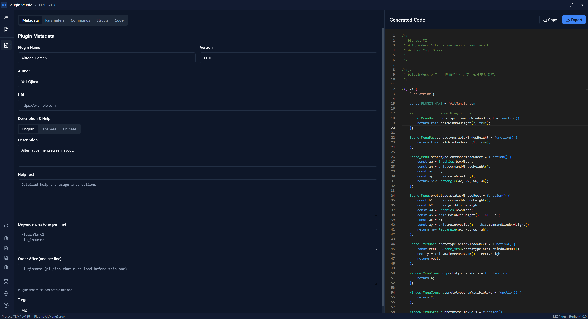
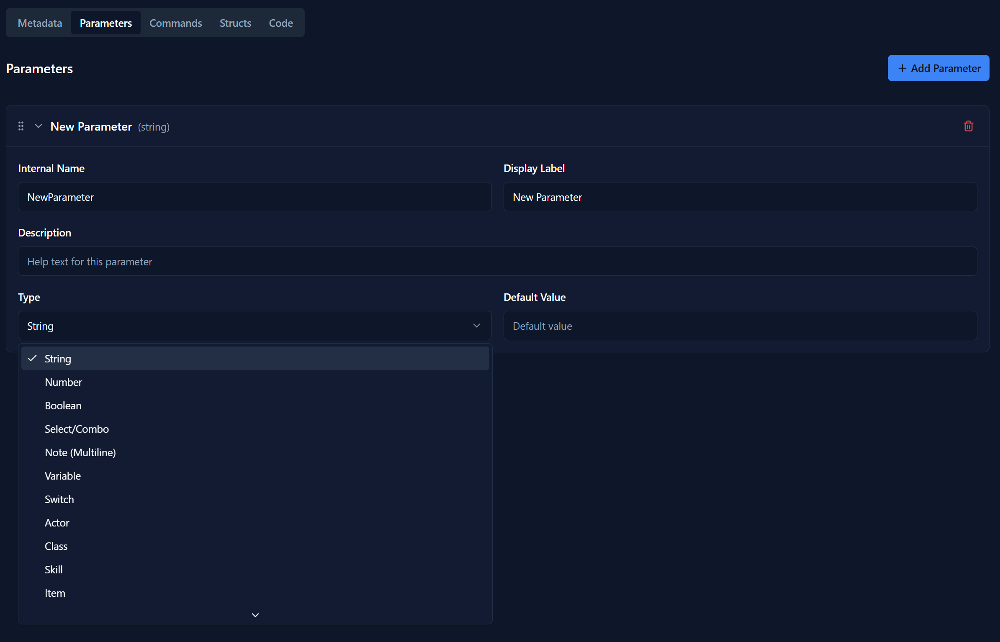
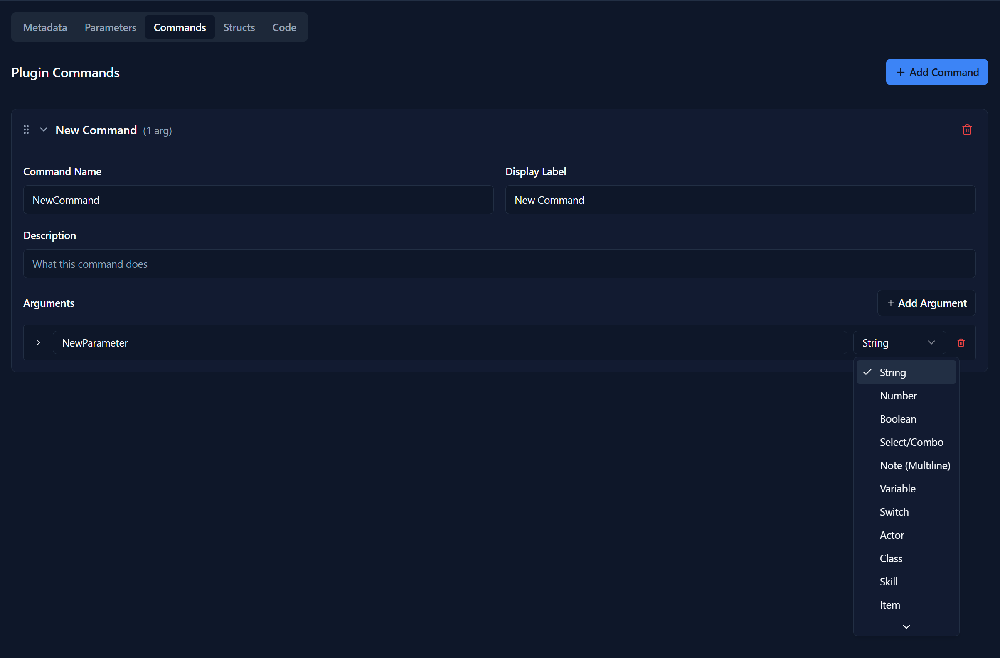
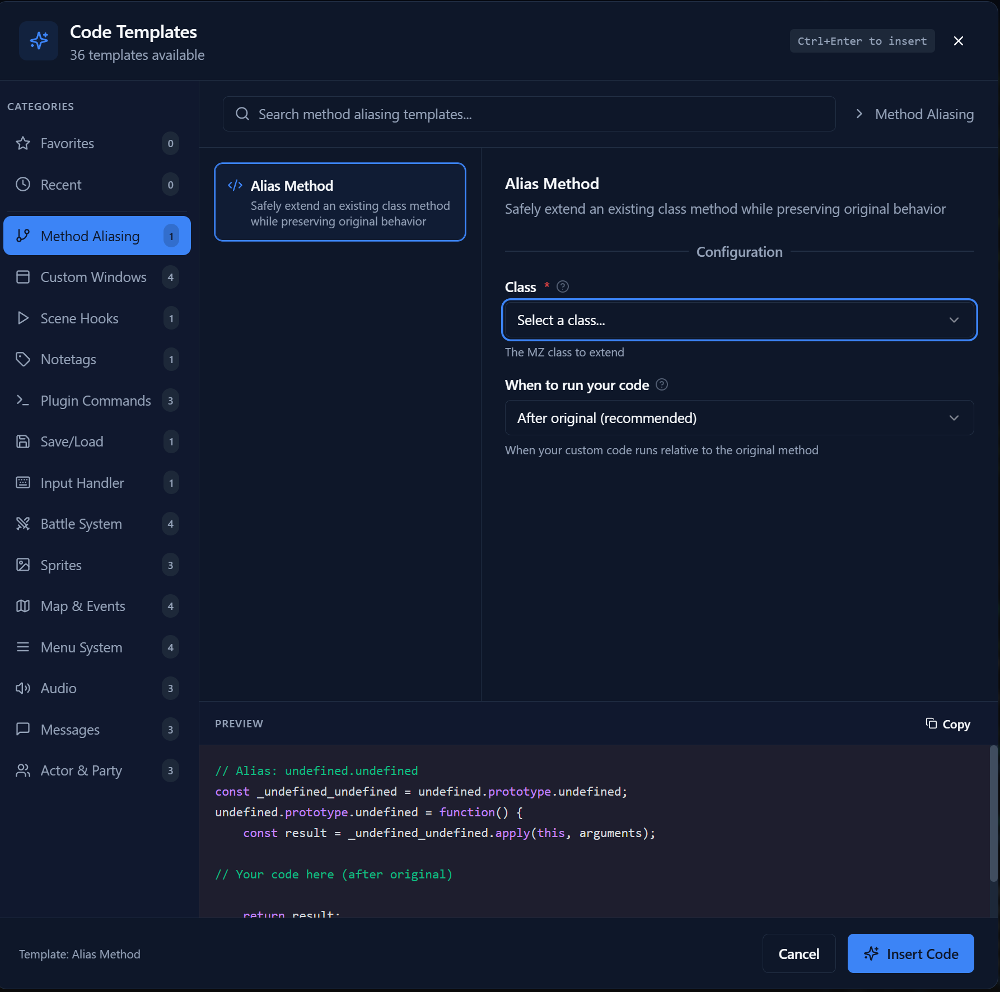

# MZ Plugin Studio

A visual no-code plugin builder for RPG Maker MZ. Create professional-quality plugins without writing JavaScript.

[](https://github.com/Wintersta7e/mz-plugin-studio/actions/workflows/ci.yml)


[](./LICENSE)

## Overview

MZ Plugin Studio provides a complete visual development environment for creating RPG Maker MZ plugins:

- **Visual Editors** - Build plugins through intuitive forms instead of writing code
- **Real-time Preview** - See generated JavaScript update as you make changes
- **Code Templates** - 36 ready-to-use templates covering common plugin patterns
- **Project Integration** - Load your MZ project for auto-populated dropdowns
- **Full Format Support** - All 26 parameter types, multi-language, structs, and arrays



## Features

### Plugin Building
- **Metadata Editor** - Name, version, author, description, help text, URL
- **Parameter Builder** - All 26 MZ parameter types with drag-and-drop reordering, bulk operations, and presets
- **Command Builder** - Plugin commands with typed arguments
- **Struct Definitions** - Complex nested data structures
- **Multi-language** - Japanese (ja) and Chinese (zh) localization tabs

### Parameter Types



All 26 RPG Maker MZ parameter types are fully supported:

| Category | Types |
|----------|-------|
| **Basic** | string, number, boolean, select, combo, note, text, hidden |
| **Game Data** | variable, switch, actor, class, skill, item, weapon, armor, enemy, troop, state, animation, tileset, common_event, map, icon |
| **Advanced** | file (with @require), struct, array, color |

### Parameter Attributes
| Attribute | Description |
|-----------|-------------|
| `@text` | Display label |
| `@desc` | Help description |
| `@default` | Default value |
| `@min` / `@max` | Number constraints |
| `@decimals` | Decimal precision |
| `@dir` | File directory |
| `@parent` | Nested parameter groups |
| `@on` / `@off` | Boolean labels |
| `@option` / `@value` | Select options |

### Plugin Commands



### Code Template Library



36 templates across 14 categories to jumpstart your plugins:

| Category | Templates | Description |
|----------|-----------|-------------|
| **Method Alias** | 1 | Extend existing MZ classes safely (139 classes, 644 methods) |
| **Custom Window** | 4 | Windows, HUDs, popups, gauges |
| **Scene Hooks** | 1 | Hook into scene lifecycle |
| **Database Extension** | 1 | Add note tag parsing |
| **Plugin Commands** | 3 | Basic, async, and validated commands |
| **Save/Load** | 1 | Persistent data storage |
| **Input Handler** | 1 | Keyboard and gamepad input |
| **Battle System** | 4 | Actions, damage, turn hooks |
| **Sprite System** | 3 | Custom sprites and animations |
| **Map Events** | 4 | Event spawning, movement, transfers |
| **Menu System** | 4 | Custom scenes, title mods, options |
| **Audio System** | 3 | BGM control, SFX, crossfades |
| **Message System** | 3 | Text codes, window mods, choices |
| **Actor/Party** | 3 | Custom properties, party management |

### Code Editor
- **Monaco Editor** - Same editor as VS Code
- **Syntax Highlighting** - JavaScript highlighting
- **Real-time Generation** - Code updates as you edit
- **Template Insertion** - One-click template insertion
- **Validation** - Real-time error and warning display
- **Raw Mode** - Imported plugins can regenerate headers only, preserving original code body verbatim
- **Diff View** - Side-by-side comparison of generated output vs saved file
- **Export Formats** - Export as .js, README.md, .d.ts type declarations, or plugins.json entry

### Project Integration
- **Load MZ Projects** - Select your project folder
- **Auto-populate Dropdowns** - All 14 MZ database types (actors, classes, skills, items, weapons, armors, enemies, troops, states, animations, tilesets, common events, switches, variables)
- **Direct Export** - Save plugins to `js/plugins/` folder
- **Import Existing** - Parse and edit existing .js plugins

### Additional Features
- **Plugin Conflict Detection** - Scans all project plugins for prototype method overrides; flags when 2+ plugins override the same method with severity based on class popularity
- **Dependency Analysis** - Scans `@base`, `@orderAfter`, and `@orderBefore` across project plugins; detects missing deps, circular deps, and load-order violations
- **Analysis View** - Dedicated view with overview stats, conflict details, and dependency issues — switch between Editor and Analysis tabs
- **Auto-Documentation** - Generate help text from plugin metadata with one click
- **Bulk Parameter Operations** - Multi-select, duplicate, delete, export/import parameters, reusable presets
- **Note Parameters** - Declare `@noteParam` groups for RPG Maker deployment packager
- **Dark/Light Theme** - Toggle between dark and light modes with full Monaco editor theme sync
- **Keyboard Shortcuts** - Press F1 for shortcuts panel (Ctrl+S/N/O, Ctrl+1-5 tab switching, F5 regenerate)
- **Auto-Update** - Checks for new versions via GitHub Releases with status bar notification
- **Struct Default Editor** - Visual inline form for struct parameter defaults with real-time JSON validation, "Fill from struct defaults" button, and type-appropriate inputs
- **Validation** - Warns about unused structs, orphaned parent references, unimplemented commands, and invalid struct default JSON
- **Logging** - Structured logging via electron-log with debug toggle in Settings; logs to file for troubleshooting

## Installation

### Prerequisites
- Node.js 18 or later
- npm or yarn

### Setup

```bash
# Clone or download the repository
cd mz-plugin-studio

# Install dependencies
npm install

# On WSL or Windows mounted drives, use:
npm install --no-bin-links
```

## Development

```bash
# Start development server with hot reload
npm run dev

# Type check only
npm run typecheck

# Run tests (239 tests)
npm test

# Build for production
npm run build

# Lint code
npm run lint

# Format code
npm run format
```

## Building for Distribution

```bash
# Windows
npm run build:win

# macOS
npm run build:mac

# Linux
npm run build:linux
```

Output will be in the `dist/` folder.

## Quick Start

1. **Launch the app** - Run `npm run dev` or the built executable
2. **Create a plugin** - Click the **+** button in the sidebar
3. **Set metadata** - Fill in name, version, author in the Meta tab
4. **Add parameters** - Click "Add Parameter" and configure each one
5. **Add commands** - Define plugin commands with arguments
6. **Insert templates** - Click the template icon in the code editor
7. **Preview code** - See real-time generated JavaScript
8. **Export** - Save to your project's `js/plugins/` folder

## Project Structure

```
src/
├── main/                    # Electron main process
│   ├── index.ts             # Window creation, app lifecycle
│   ├── updater.ts           # Auto-update (GitHub Releases)
│   ├── ipc/                 # IPC handlers
│   │   ├── dialog.ts        # File dialogs
│   │   ├── plugin.ts        # Plugin load/save/parse
│   │   └── project.ts       # MZ project loading
│   └── services/
│       └── pluginParser.ts  # Parse existing plugins
├── preload/
│   └── index.ts             # Context bridge (window.api)
├── shared/
│   ├── ipc-types.ts         # Typed IPC channel constants
│   └── override-extractor.ts # Prototype override extraction (shared main/renderer)
└── renderer/src/            # React frontend
    ├── components/
    │   ├── plugin/          # Main editors
    │   ├── preview/         # CodePreview, DiffView
    │   ├── analysis/        # AnalysisView (conflicts + dependencies)
    │   ├── settings/        # SettingsDialog, ShortcutsDialog
    │   └── ui/              # shadcn/ui components
    ├── stores/              # Zustand stores (one per domain)
    │   ├── pluginStore.ts
    │   ├── projectStore.ts
    │   ├── settingsStore.ts
    │   └── ...
    ├── lib/
    │   ├── generator/       # Code generation + validation
    │   ├── conflict-detector.ts   # Plugin conflict detection
    │   ├── dependency-analyzer.ts # Plugin dependency graph + validation
    │   ├── param-io.ts      # Parameter import/export (.mzparams)
    │   ├── exportFormats.ts  # README, .d.ts, plugins.json
    │   ├── shortcuts.ts     # Keyboard shortcut definitions
    │   └── mz-completions.ts # Monaco MZ autocomplete
    └── types/
        └── plugin.ts        # TypeScript interfaces
tests/                       # Vitest unit tests (239 tests)
```

## Tech Stack

| Technology | Purpose |
|------------|---------|
| [Electron](https://electronjs.org) | Desktop application shell |
| [React 19](https://react.dev) | UI framework |
| [TypeScript](https://typescriptlang.org) | Type-safe development |
| [electron-vite](https://electron-vite.org) | Build tooling |
| [Tailwind CSS](https://tailwindcss.com) | Styling |
| [shadcn/ui](https://ui.shadcn.com) | UI components |
| [Zustand](https://zustand-demo.pmnd.rs) | State management |
| [Monaco Editor](https://microsoft.github.io/monaco-editor) | Code editor |

## Documentation

- **[User Guide](./docs/USER_GUIDE.md)** - Detailed usage instructions

## Contributing

Contributions are welcome! Please:

1. Fork the repository
2. Create a feature branch
3. Make your changes
4. Run `npm run lint` and `npm run typecheck`
5. Submit a pull request

## License

MIT License - see [LICENSE](./LICENSE) for details.

Third-party dependency licenses are listed in [THIRD_PARTY_LICENSES.md](./THIRD_PARTY_LICENSES.md).

## Disclaimer

"RPG Maker" and "RPG Maker MZ" are trademarks of Gotcha Gotcha Games / Kadokawa Corporation. MZ Plugin Studio is an independent, community-developed tool and is not affiliated with, endorsed by, or sponsored by Gotcha Gotcha Games or Kadokawa Corporation.

## Support

If you find this tool useful, consider supporting its development:

- Star this repository
- [Report issues](../../issues) or suggest features
- Contribute code or templates
